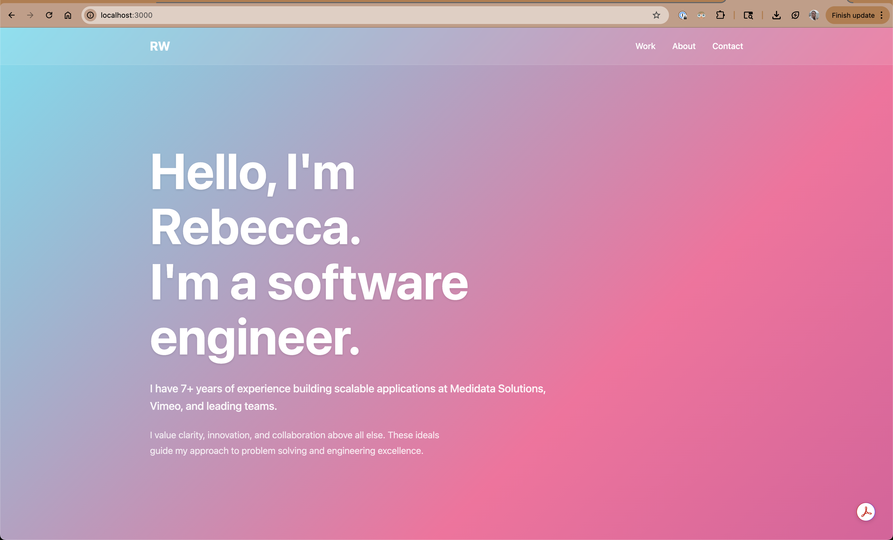

This project is the result of my initial round of playing around with Claude. I worked to give it several prompts, with inspiration photos, until I achieved something that I like as a first iteration of my personal dev site.

This works on localhost, and is deployed on github pages.

## [Visit Site](https://rweir4.github.io/portfolio_site/)

Credit: Icons by Muhammad_Usman, IcoMania, Smashicons, and Freepik on FlatIcon